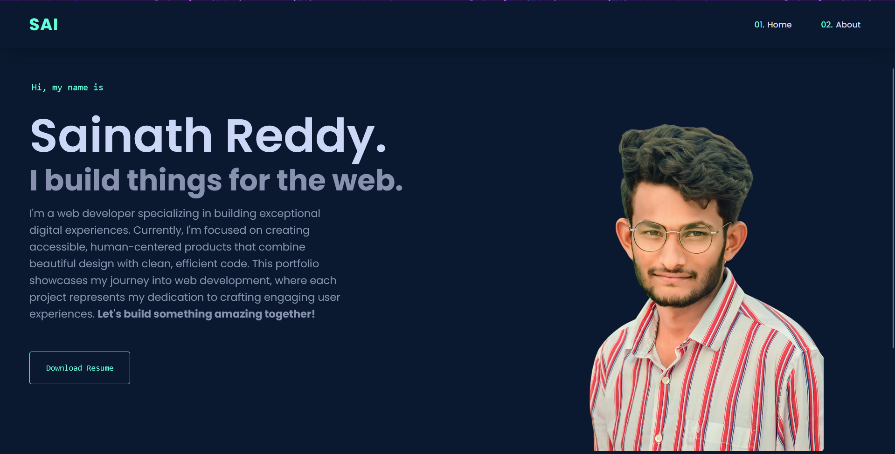

# 🌐 Sainath's Portfolio

## 🔗 [View Live Site](https://sainath-666.github.io/Portfolio_1/)

## 📋 About This Project

This is my responsive portfolio website built with HTML and CSS. It features a clean design that works well on all devices - from mobile phones to desktop computers.

## 🚀 Features

- **Fully Responsive Design**: Looks great on all devices
- **Modern UI**: Clean and professional appearance
- **Animations**: Subtle animations for better user experience
- **Resume Download**: Easy access to my professional resume

## 💻 Technologies Used

- HTML5
- CSS3
- Font Awesome Icons
- Google Fonts

## 🔧 Setup

1. Clone this repository
2. Open `index.html` in your browser
3. That's it!

## 📱 Responsive Design

The website is fully responsive with carefully crafted media queries that ensure optimal viewing experience across a wide range of devices:

- Desktop (1200px and above)
- Laptop (992px - 1199px)
- Tablet (768px - 991px)
- Mobile (576px - 767px)
- Small Mobile (below 576px)

## 📬 Contact

Feel free to reach out to me through my social media links on the website!
---

  
Made with ❤️ by Your Sainathreddy

[https://github.com/sainath-666](https://github.com/sainath-666)
[https://www.linkedin.com/in/sainath666](https://www.linkedin.com/in/sainath666)
